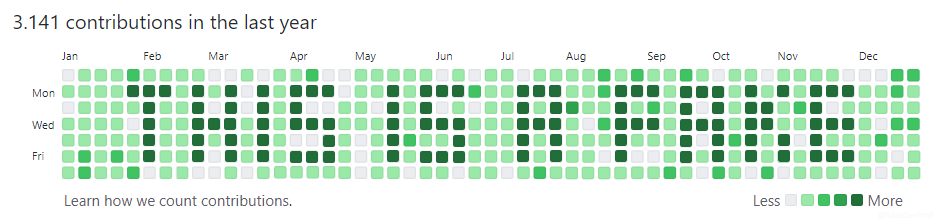

### It's-a me!

* 💬 Ask me about uncommon algorithmic approaches and crazy one-liners that no one would ever use in production
* ☕ My favorite `java` one-liner:
  ```java
  for (int i = 10; i <= 109; System.out.printf("%6s", ++i % 10 == 0 ? i - 10 + "\n" : "\b" + i % 10 * (i / 10)));
  ```
* 🔪 My favorite `c#` one-liner:
  ```csharp
  Console.WriteLine("n.a.");
  ```
* 📫 How to reach me: [silas.schnurr.one](https://silas.schnurr.one)
* ⚡ Fun fact: My middle name is Mario (therefore the greeting...)

<!--
* 🔭 I’m currently working on ...
* 🌱 I’m currently learning ...
* 👯 I’m looking to collaborate on ...
-->


\
\
\
\
\


<!--
https://github-readme-stats.vercel.app/api/top-langs/?username=silasderprofi&theme=light&layout=compact&langs_count=100&hide=CSS,scss,makefile,batchfile,shell
https://github-readme-stats.vercel.app/api?username=SilasDerProfi&show_icons=true
https://github.com/anuraghazra/github-readme-stats
-->
<!--
<p align="right">
    Less ... More
  
  <table>
    <tr><td>r0c0</td><td>r0c1</td></tr>
    <tr><td>r1c0</td><td>r1c1</td></tr>
    </table>
</p>
-->
